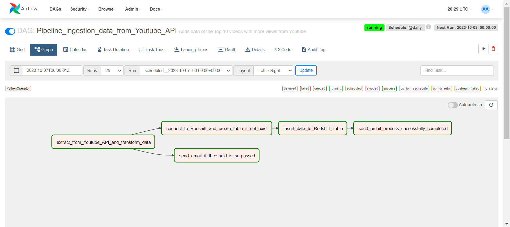
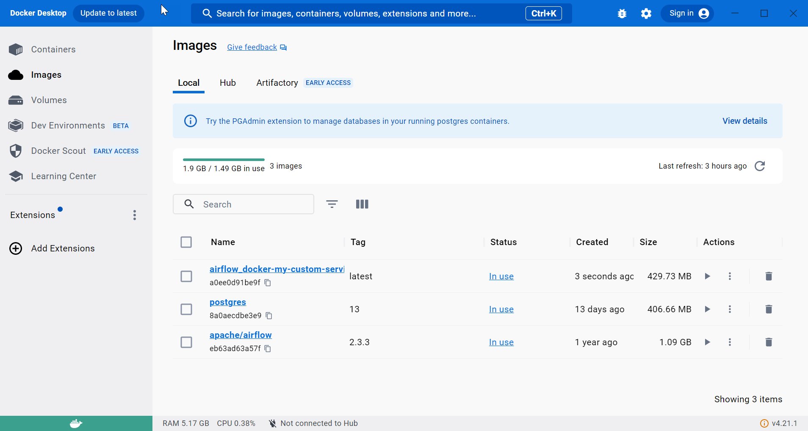
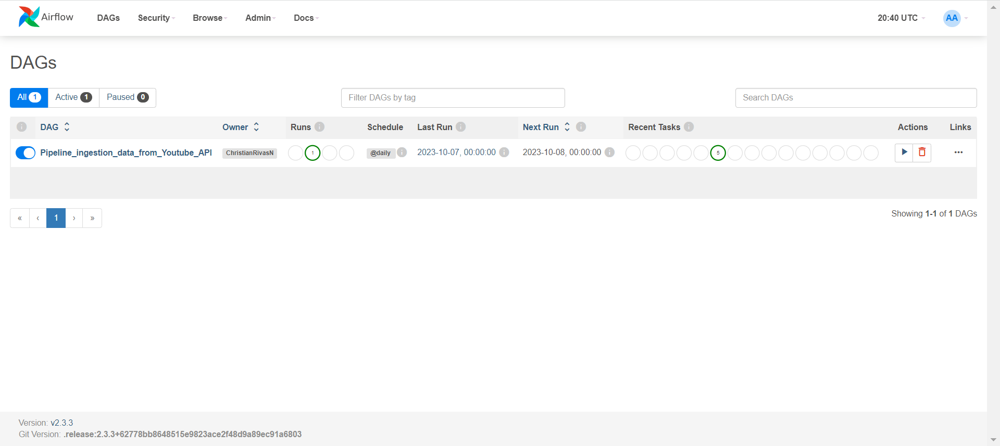
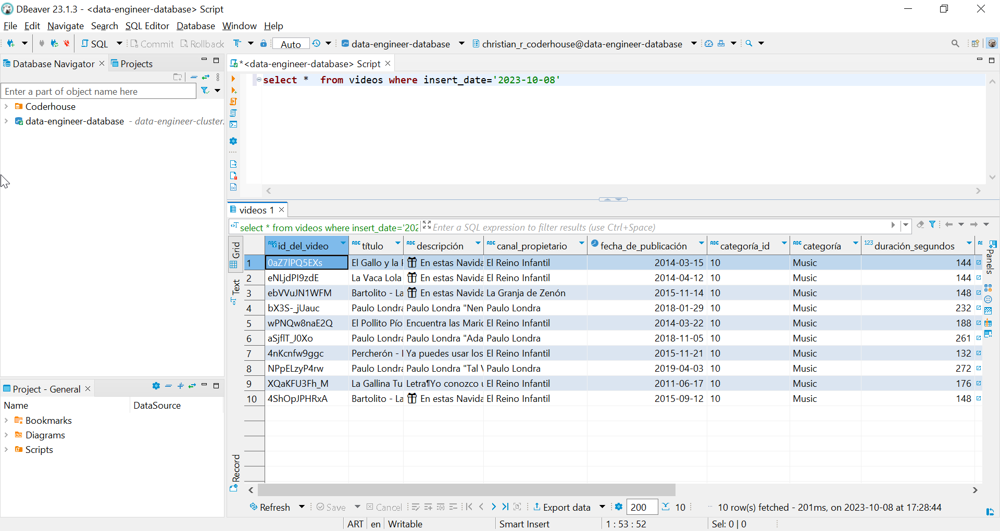
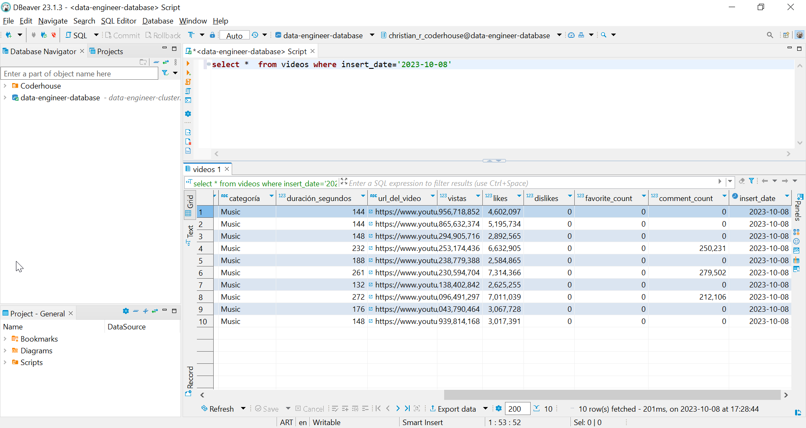
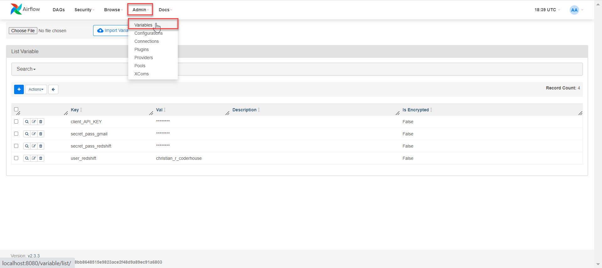
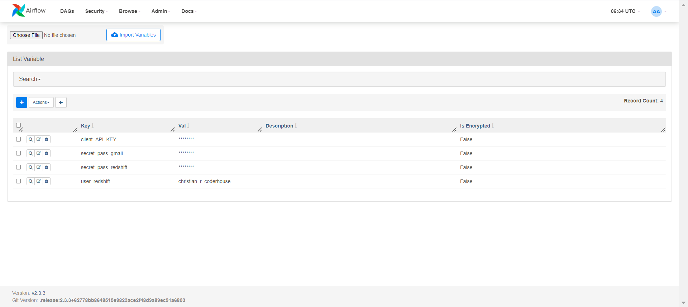
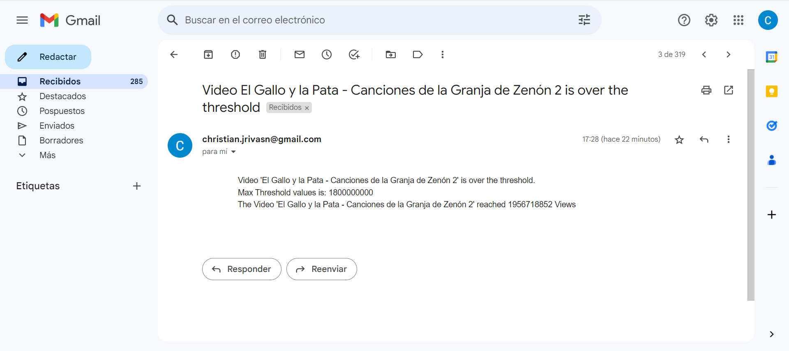
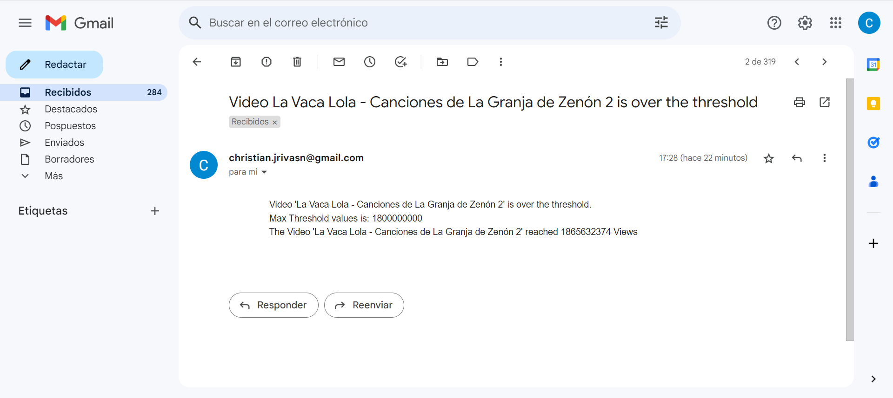
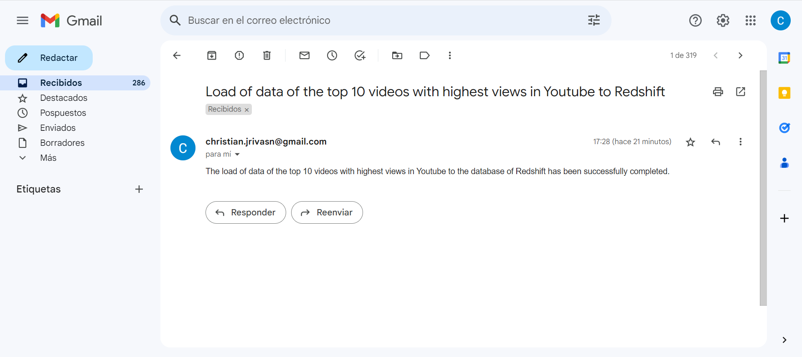

# Coderhouse's Data Engineering Example Final Project

**Developed by Christian Javier Rivas Nieto**

## Requirements:
- Have Docker.
- Have a gmail account for receiving email's alerts.

## Description:
This code gives you all the tools to run the specific DAG called "Pipeline_ingestion_data_from_Youtube_API".

What this DAG does is:

1. Task 1: Daily extracts data from the top 10 Videos with highest number of Views in Youtube and Transforms the data to the required format (such as columns of Dates or lenghts in Descriptions and Names).
2. Task 2: Connects to Redshift and creates a table if it previously didn´t exist.
3. Task 3: Saves the extracted and transformed data into that Redshift Database (simulating a Data Warehouse). Inserts the data with the "insert_date" column into the table created in step 2.
4. Task 4: Checks against a config file (config.json) if the values of views of the Videos surpass the thresholds. If they do, it sends an email to whatever address you have configured alerting about the Videos exceeding the limits.
5. Task 5: Sends an email confirmation of process successfully completed (to the address you have previously configured) when the process finishes correctly.

## Configuring your Credentials:
In the "Youtube_ETL.py" file, set "sender_email" to your gmail account. Set "sender_email" to whatever address you want the emails to go too (I suggest using the same email msg_from and msg_to).

Within Airflow interface, remember to create the "secret_pass_gmail" in Admin --> Variables. Enter your gmail security application password and save it within the variable.

Remember: emails may go to SPAM. Check that folder.

Besides, create 3 more variables in Airflow interface (Admin --> Variables): 
- "user_redshift", "secret_pass_redshift" variables: with the information of your Redshift account within the "data-engineer-database".
- "client_API_KEY" variable: with the API_KEY that you obtain to use the Youtube API.

## Usage:
It's easy, just do:

1. Open Docker Desktop. Wait until the Docker whale logo at the left bottom of the window is in white and green.
2. Open the Command Prompt and go to the Directory in which you have your DAG folder (in my case I have it in a folder called "airflow_docker" in My Desktop. Once opened the command prompt, run the commands: **cd Desktop** --> **cd airflow_docker**).
3. If it is the first time that you are executing this process, you need to install Airflow.
Run the command: **curl -o docker-compose.yaml https://airflow.apache.org/docs/apache-airflow/2.3.3/docker-compose.yaml** (this will create the .yaml file in your folder. Remember to replace this file for the one of the link of the video of Coderhouse in order to use localhost:8080).
Then, to complete the installation of Airflow in your computer run the following command: **docker-compose up airflow-init**. When the installation is completed, you can go to step 3. **Remember that Step 2 is only needed when you run the process for the first time**.
4. To execute Airflow, run the command: **docker-compose up**. When the console finishes loading, you can go to Step 4. **Remember that Step 2 (commands 3 and 4) is only needed when you run the process for the first time**:
        C:\Users\cnieto1>cd Desktop

        C:\Users\cnieto1\Desktop>cd airflow_docker

        C:\Users\cnieto1\Desktop\airflow_docker>curl -o docker-compose.yaml https://airflow.apache.org/docs/apache-airflow/2.3.3/docker-compose.yaml

        C:\Users\cnieto1\Desktop\airflow_docker>docker-compose up airflow-init

        C:\Users\cnieto1\Desktop\airflow_docker>docker-compose up

5. Enter localhost:8080 in whatever browser (Google Chrome for example) you want.
6. Input admin as the user and the password (by default of the yaml file, user and password are both "airflow").
7. Once inside, activate the DAG, wait for it to turn dark green and voila! The pipeline ran.
8. To stop the job and process, you can make stop.

## Repository Content:
The following repository includes the following files:
- "Youtube_ETL.py": .py file including the Python script with the 5 tasks of the process (extracting data from the Youtube API and transforming, Connecting to Redshift, Inserting the extracted data into the Redshift table, verifying and sending an email alert if the thresholds are surpassed, and sending an email to confirm that the process has been completed).
- "DAG_Entregable.py": file creating and setting the DAG parameters, and associating the 5 Tasks of the process with the 5 functions of the "Youtube_ETL.py" Python Script.
- "Dockerfile": Dockerfile to install all the dependencies (Python libraries) that are needed to run the Pipeline.
- "requirements.txt": txt file indicating the versions of each of the libraries that we need to install so that the process could run successfully on any other machine, computer or device.
- config.json: json file containing the max thresholds of number of Views for each Category (Music, Sports, Education, etc) of the Videos in Youtube. 
- "docker-compose.yaml": The .yaml file orchestrates different containers to communicate with each other. It is used to define the configuration of a container environment or to orchestrate multiple containers.
The .yaml file in this case orchestrates these 3 images, that is why when running the yaml in the command prompt we have these 3 images in Docker:
a. "postgres" image: Creates the necessary conditions to install Postgre SQL.
b.  Image "apache/airflow": Creates the conditions to install Airflow.
c. Image "airflow_docker-my-custom-service": Creates the necessary conditions to install the libraries and dependencies that we need for our process and that are indicated in the "Dockerfile" and "requirements.txt" files.
- "Entregable Final - Christian Javier Rivas Nieto - Extract data from Youtube API.ipynb": This ipynb file is a Jupyter Notebooks file in which I tested the Python Script step by step which you can find in the "Youtube_ETL.py" file.
Once I verified that the process was working well in the Jupyter Notebooks file, I took that Script to the "Youtube_ETL.py" file in Visual Studio Code to convert its file format to the .py format (it is convenient to use .py file format to create and automate Pipelines).
- "Images of evidence of process executed successfully in Airflow" Folder: Contains images (.png files) of evidence showing that the process works correctly in Airflow, that the data is successfully inserted into the Redshift table, that the email alert is received whenever the number of views of any video surpass the threshold, and that the email is sent correctly indicating that the process was completed successfully.
- "Consigna Proyecto Final.pdf": PDF file indicating the project requirements that are met with the files in this repository.
- "user_redshift.txt": .txt file containing my username from the Redsfhit Database in which we want to insert the data extracted from the Youtube API (in the "videos" table of that Redsfhit Database).
- "redshift_password.txt": .txt file containing the password of my Redshift Database in which we want to insert the data extracted from the Youtube API (in the "videos" table of that Redsfhit Database).
- "api_key_youtube.txt": file containing the client_api_key of the Youtube API.
- "airflow.cfg" file:  This file is used to configure and customize the Apache Airflow instance according to the specific needs of a project or implementation. It allows defining how Airflow behaves and operates.
- webserver_config.py: This file is used to control and manage the Airflow web server. It helps identify and stop the web server process when needed.
- "airflow_docker" Folder: Folder that I have on my Desktop including all previouslly mentioned files, and with the structure so that the process can be executed on my computer directly with the following Commands in the "Command Prompt":
Commands to execute in the Command Prompt:

        C:\Users\cnieto1>cd Desktop

        C:\Users\cnieto1\Desktop>cd airflow_docker

        C:\Users\cnieto1\Desktop\airflow_docker>docker-compose up

## Evidence pictures of the process:

### - Images created in Docker:

### - DAG - Job of the Pipeline successfully completed:

### - Process completed in Redshift Table - Insert Data in "Videos" Table:

### - Creation of Variables in Airflow Interface:

### - Email alert of Videos which number of Views surpassed the threshold - Successfully received:

### - Email alert of process successfully completed - Successfully received:

